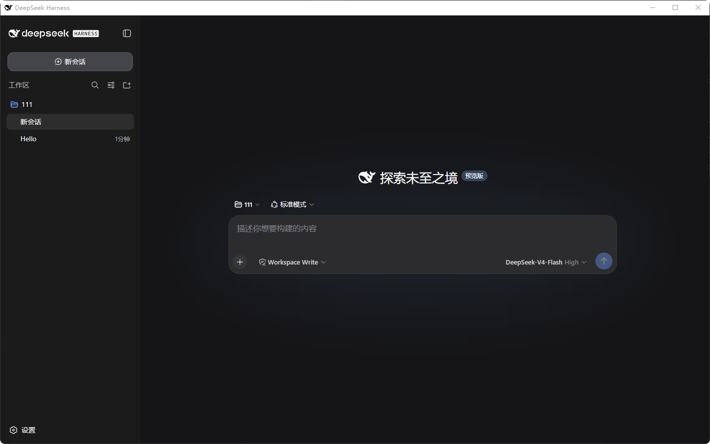
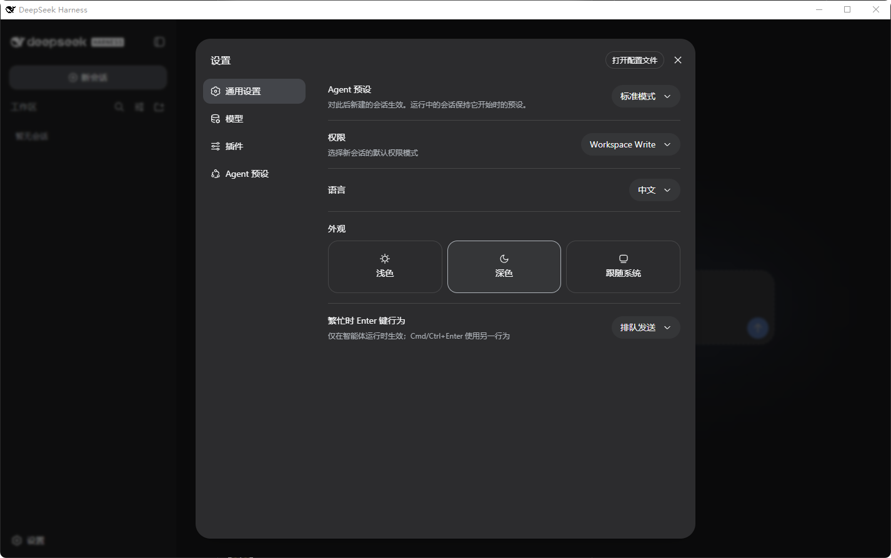
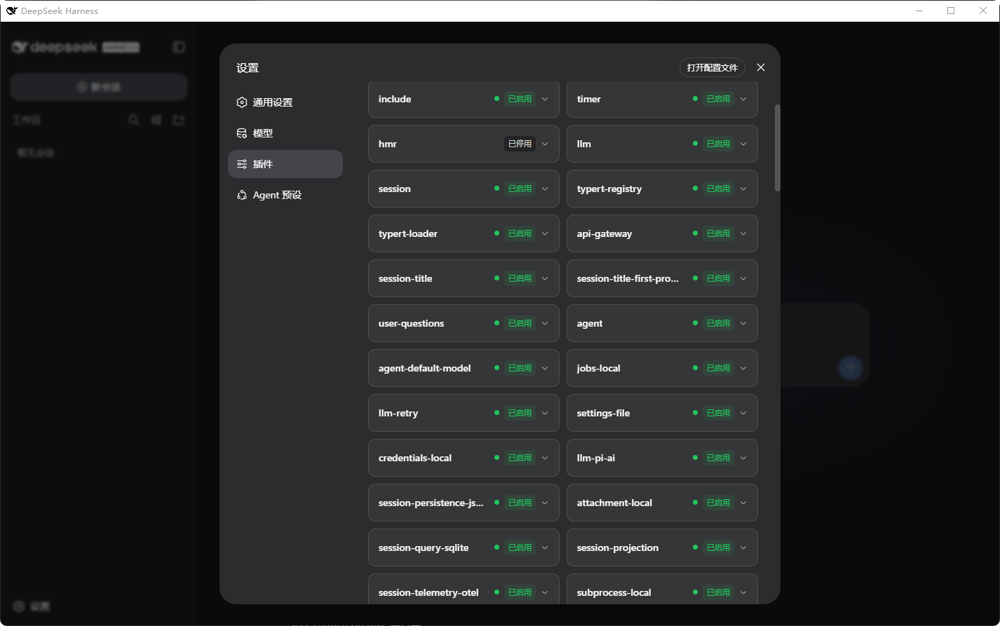
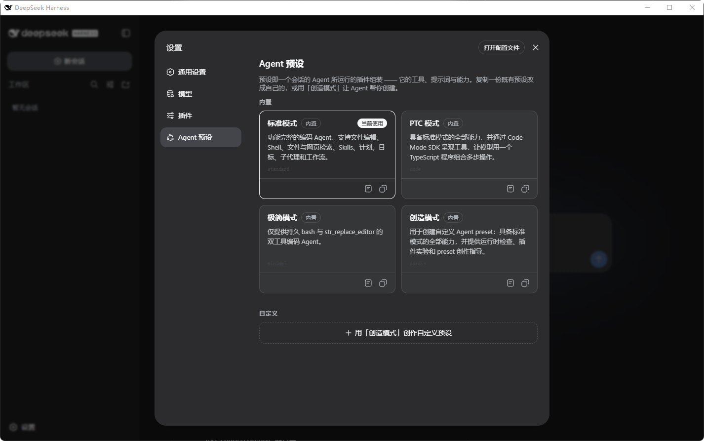

# DeepSeek Harness Windows 桌面版

这是基于 [DeepSeek 官方开源项目 deepseek-harness](https://github.com/deepseek-ai/deepseek-harness) 制作的非官方 Windows 桌面版本。

本项目保留原网页版本的页面布局、背景、图标与功能，通过 Electron 将网页界面、本地服务和完整运行时封装为 Windows 应用。目前只制作和测试了 Windows x64 版本，不提供 macOS 或 Linux 构建。

## 下载

请前往仓库的 [Releases](https://github.com/3960922808-jpg/deepseek-harness-Installed-version/releases) 页面下载：

- `DeepSeek Harness Setup 0.1.0-rc.5.exe`：Windows 安装版，推荐日常使用。
- `DeepSeek Harness 0.1.0-rc.5.exe`：单文件便携版。由于包含大量插件文件，每次启动需要先解压，启动速度慢于安装版。
- `DeepSeek-Harness-Windows-Source-0.1.0-rc.5.zip`：本次 Windows 桌面改版的完整源码。

## 功能

- 原版 DeepSeek Harness 网页界面、深浅色主题与响应式布局。
- 工作区和会话管理，支持 Windows 原生文件夹选择器。
- DeepSeek 模型配置、凭据管理与推理等级选择。
- 标准、PTC、极简、创造等 Agent 预设。
- 插件管理、技能、计划、目标、子代理和工作流能力。
- 文件、命令行、PowerShell、网页检索等工具能力。
- Workspace Write 等权限模式。
- 内置 Electron、Node.js 和运行依赖，无需另装 Node.js 或 pnpm。
- 本机随机端口启动服务，关闭窗口时自动清理后台进程。
- 单实例运行、外部链接交给系统浏览器、启动与服务日志记录。
- Windows 应用标识与黑鲸任务栏图标。

## 截图

### 主界面

### 通用设置

### 插件管理

### Agent 预设

## 使用说明

1. 下载并运行安装版，或运行便携版。
2. 首次进入后打开“设置 → 模型”。
3. 配置 DeepSeek 接口地址、模型和接口凭据。
4. 选择或添加一个本地工作区，然后新建会话。

接口凭据只保存在本机用户数据目录中，不包含在安装包或仓库内。

## Windows 数据目录

- Harness 数据：`%APPDATA%\DeepSeek Harness`
- 桌面容器数据与日志：`%APPDATA%\@deepseek-ai\dsh-desktop`

## 开源说明

- 上游源码：[deepseek-ai/deepseek-harness](https://github.com/deepseek-ai/deepseek-harness)
- 上游许可证：MIT
- 本仓库是面向 Windows 的非官方桌面封装与兼容性改版。
- DeepSeek、DeepSeek Harness 及相关标识归其权利人所有。

本项目与 DeepSeek 官方没有隶属或背书关系。
